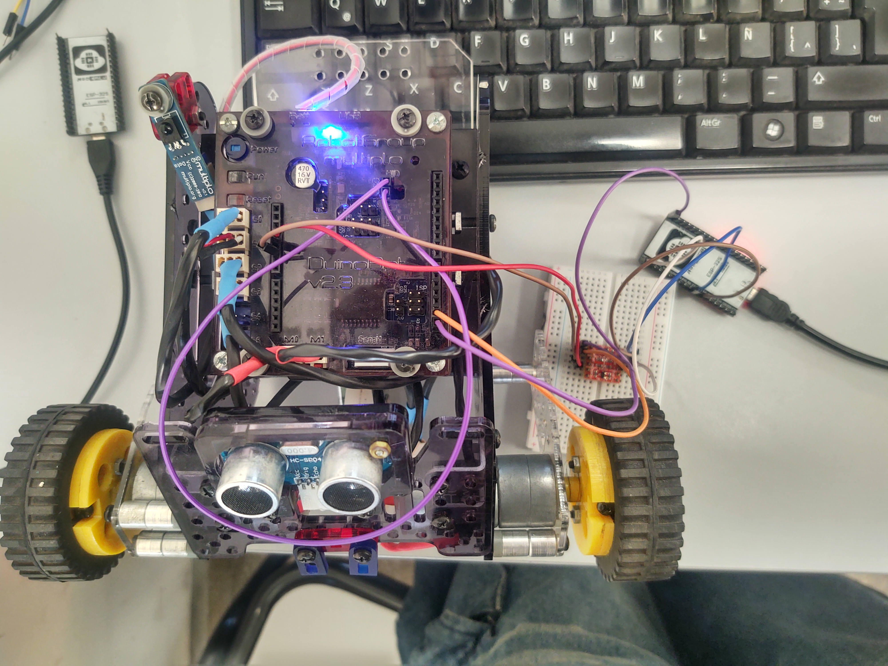
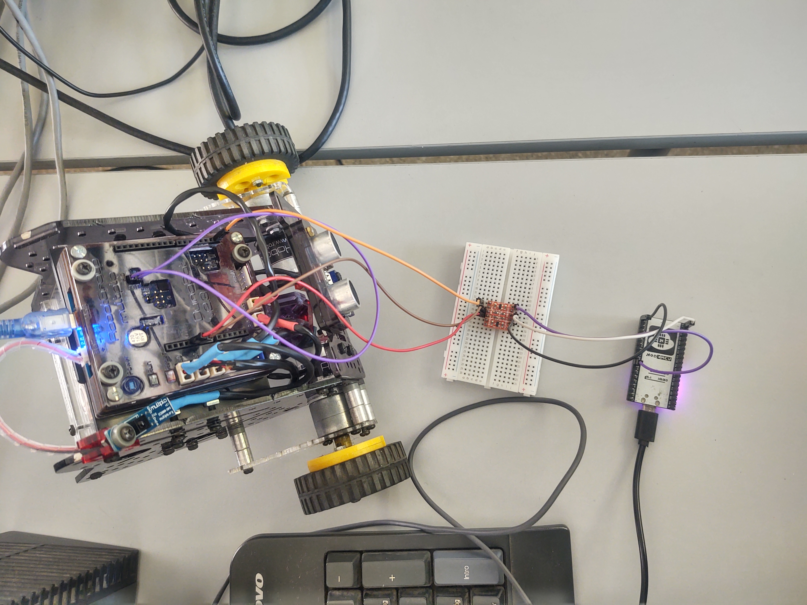
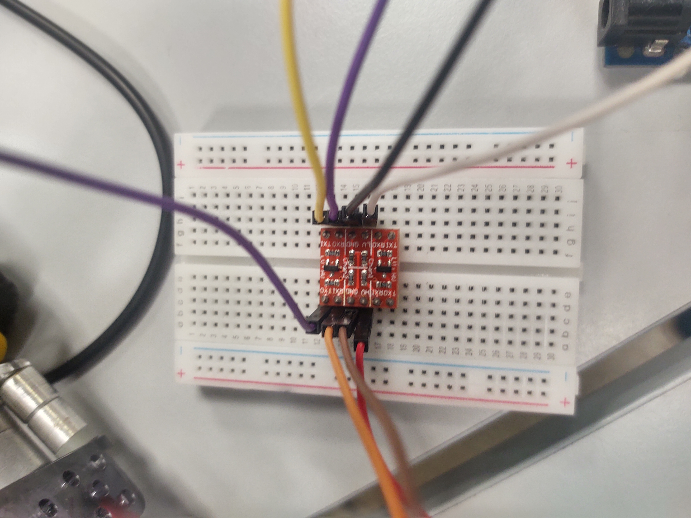

# 🚗 Vehículo controlado a distancia
# Robot Múltiplo N6 — DuinoBot v2.3  
**Controlado por MQTT — Documentación completa**

---

## 👥 Integrantes
- Adan Coronel  
- Benjamín Martinez

---

## 📸 Foto del robot

## 📸 Foto del circuito del robot

## Video del proyecto andando

<figure class="video_container">
 <video controls="true" allowfullscreen="true">
 <source src="duinobotconesp.mp4" type="video/mp4">
 </video>
</figure>
---

# 🛠️ Pasos (Windows / macOS / Linux)

1.Instalar Arduino IDE

  Baja e instala la versión oficial (IDE 1.8.x o IDE 2.x funcionan). Página oficial de descargas. arduino.cc

  Nota: El IDE 1.8.X es usada para el duinobot.
  El IDE 2.X fue usada para el NodeMCU-32.

2.Agregar el soporte del DuinoBot al Board Manager

  Abre Arduino IDE → File (Archivo) → Preferences (Ajustes).

  En Additional Boards Manager URLs pega esta URL:

      https://raw.githubusercontent.com/Robots-Linti/Multiplo/master/package_SoporteLihuen_DuinobotAVRBoards_index.json

Guarda. (Puedes añadir varias URLs separadas por comas o en el diálogo si usás IDE 2.x).

3.Instalar el paquete de placas

  Arduino IDE → Tools (Herramientas) → Board (Placa) → Boards Manager…

  Busca Duinobot AVR Boards y click en Install. Reinicia el IDE si no aparece inmediatamente.

4.Seleccionar la placa y la configuración

  Tools → Board → seleccioná la entrada Duinobot v2.3 / Multiplo N6-MAX (ATmega1284) o la opción equivalente dentro del paquete.

  Tools → CPU / Variant → elegí ATmega1284 (si hay sub-opciones).

  Tools → Clock / Frequency → por defecto 16 MHz (el paquete documenta soporte a 20/16/8/1 MHz — confirmá cuál tiene tu placa). 

5.Seleccionar puerto y programador

  Conectá el DuinoBot por USB (o el adaptador USB-Serial que venga). Tools → Port → seleccioná el puerto COM/tty asignado.

  En la mayoría de los casos para cargar sketches por USB no necesitás cambiar el "Programmer". Si necesitás grabar el bootloader (ver abajo) entonces usarás Arduino as ISP u otro programador compatible.
    

 6.Subir un sketch de prueba (Blink)

  Abre el ejemplo File → Examples → 01.Basics → Blink.

  Uso recomendado: reemplazar LED_BUILTIN por el pin que indique el pinout si el LED integrado no responde; pero probá primero con LED_BUILTIN.

  Click Upload (flecha). Si todo está bien, compila y sube.

      Ejemplo (idéntico al ejemplo Arduino):

      void setup() {
        pinMode(LED_BUILTIN, OUTPUT);
      }
      void loop() {
        digitalWrite(LED_BUILTIN, HIGH);
        delay(500);
        digitalWrite(LED_BUILTIN, LOW);
        delay(500);
      }

 7.Si falla la carga por serial (problemas comunes)

  Confirmá puerto y drivers (ej. chips CH340/FTDI).

  Si la placa no tiene bootloader compatible o nunca se le grabó el bootloader del paquete, puede ser necesario grabar el bootloader usando otra placa Arduino como programador (ArduinoISP) — el repo oficial del paquete explica cómo hacerlo (conexiones y pasos). 

  8.Quemar bootloader (solo si indica el paquete / la placa lo requiere)

    Programá un UNO/Nano con el sketch ArduinoISP (Arduino → Examples → 11.ArduinoISP → ArduinoISP). Conectá ISP (MOSI/MISO/SCK/GND/Reset) según las tablas del repositorio.

    En el IDE seleccioná la placa Duinobot v1.2 / v2.3 apropiada en Tools, el puerto de la placa programadora, y Tools → Burn Bootloader.

---

## **Conexiones del NodeMCU-32**

## **Foto del ESP-32**

## **Foto dela Placa duinobot v2.3**

## **Foto del cuircuito completo**

## **Diagrama de Bloques de conexion**

Aqui el usuario envía un mensaje desde su PC a un servidor MQTT. Este mensaje es recibido por el ESP32, que lo transmite al Duinobot, activando los motores del robot según la instrucción recibida.

El adaptador se encarga de traducir la señal digital para asegurar que el ESP32 y el Duinobot sean compatibles en términos de voltaje, evitando posibles fallos en la comunicación..

## **Diagrama de Bloques de comunicacion**

Cuando la PC envía un mensaje al broker MQTT. Este mensaje es recibido por el ESP32, que lo transmite a través del puerto Serial2 al Duinobot para controlar los motores, según la instrucción recibida.

## **Diagrama Flujo**

Aqui vemos como es el funcionamineto al mandar un mensaje desde el broker y como el Duinobot reacciona a los mensajes recibidos
